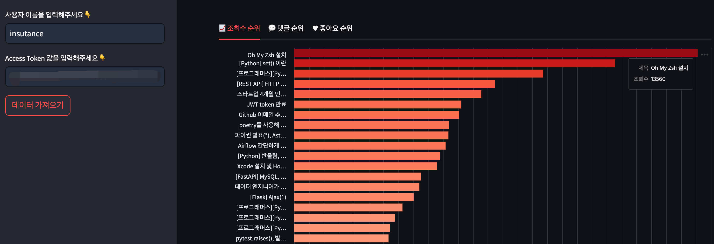

# 🍕 velog-hits
**velog-hits**를 사용하면 자신의 velog 게시글 조회수 통계 및 순위를 종합해서 한 눈에 볼 수 있습니다-!

## 📍 Demo Image

## 📍 사용방법

### 0. 사용하기 전에
> ⚠️ Access Token을 모르신다면 해당 기능을 사용하실 수 없습니다.

Velog Hits를 사용하기 위해서는 자신의 **Velog Username(=ID)** 와 **Access Token**이 필요합니다. 
"조회수 통계"는 로그인 했을 때만 볼 수 있는 기능이기 때문에 Access Token이 필요합니다. Access Token을 통해 본인임을 인증할 수 있습니다. 

> 💡 Access Token 확인하는 방법

1. 자신의 velog 접속 및 로그인
2. F12 - Application - Storage - Cookies - https://velog.io - access_token을 확인하시면,
리로딩 없이도 access_token을 찾을 수 있습니다:)

### 1. 아래 링크를 통해 velog-hits 접속
Link: https://velog-hits.streamlit.app/

### 2. 필요 데이터 입력
* `username`, `access token` 값 입력
* `데이터 가져오기` 클릭

### 3. 결과 확인
잠시만 기다리시면, 3가지 데이터 순위를 볼 수 있습니다:)
* 조회수 순위
* 댓글 순위
* 좋아요 순위
